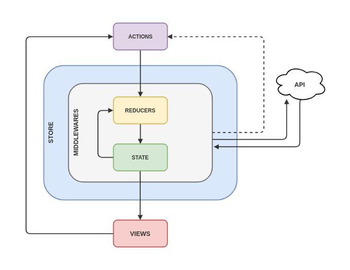

#### Scorebird Web Application Framework
---

#### Backend(Tech)
---
- Node
- Express
- MongoDB
- Mongoose

#### Features
---
- Node.js as a `Static Server`
- Node.js as an `RESTful API Server`
- `REST Endpoints` for multiple `resources` in a generic way
- `Authentication` / `Authorization` using stateless `JWT Token`
- Writing Database `Schemas` using `Mongoose`
- `Mongoose` provides schema validation
- setting up `development` / `production` Environments

#### Frontend(Tech)
---
- React
- React Router
- Redux
- Redux Thunk
- Atlaskit

#### Features
---
- setting up React/Redux `Workflow`
- setting up `Authentication` / `Authorization`

#### Coding Guidelines
---
- All the Environment variables in `.env` file
- npm scripts for automation(`source code formatting`, `auto-restart` etc...)
- Folder Structure

